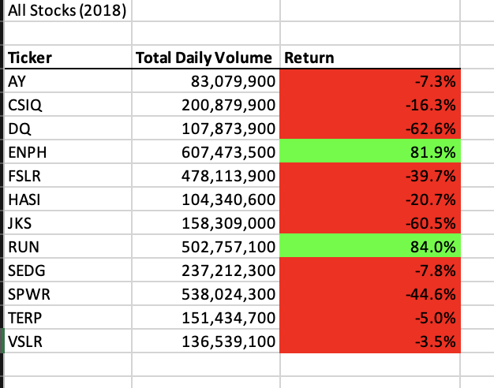
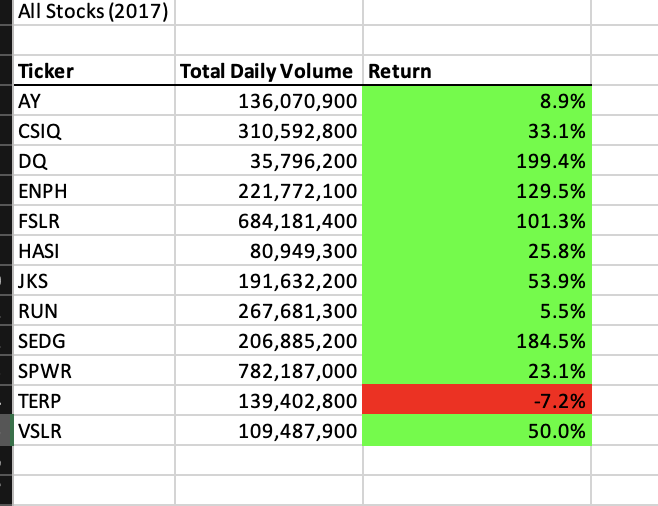
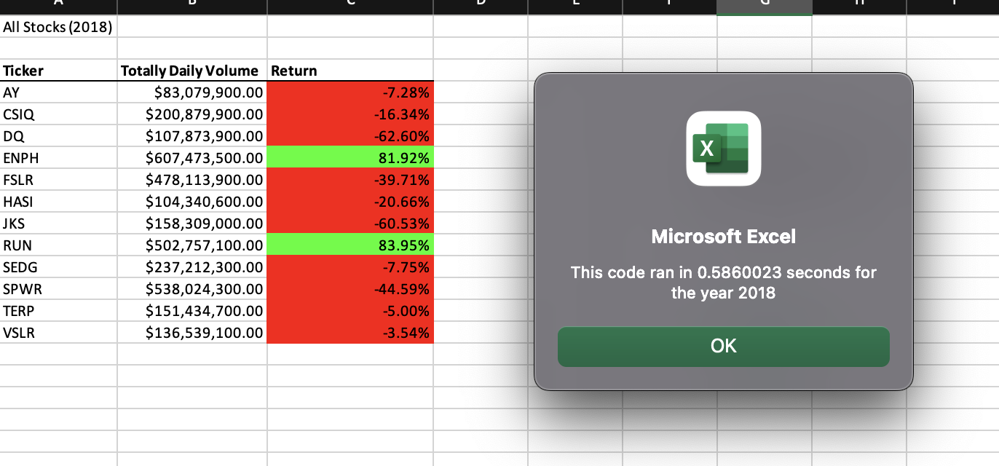
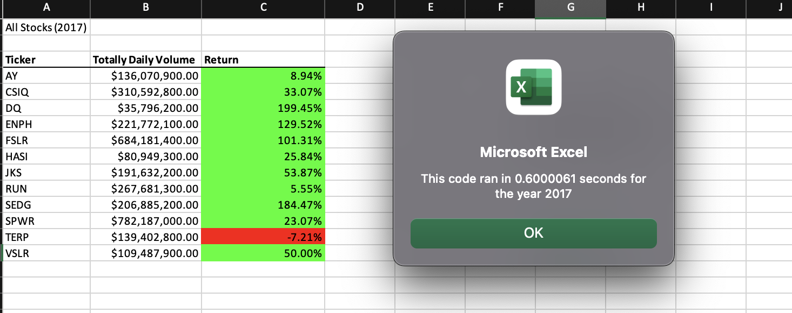
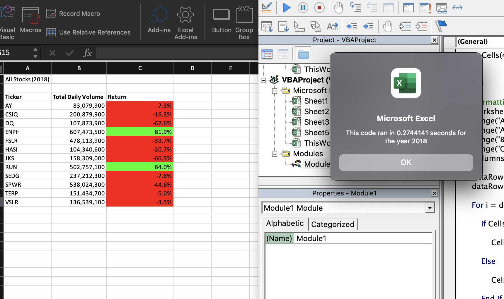
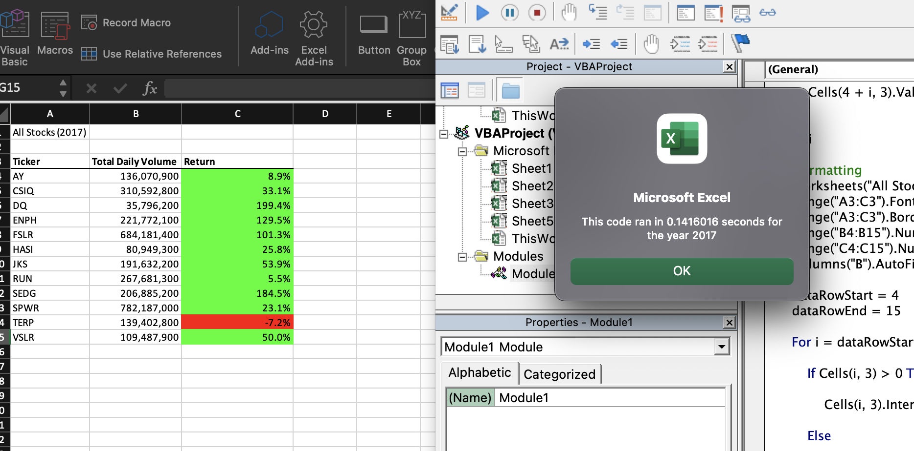
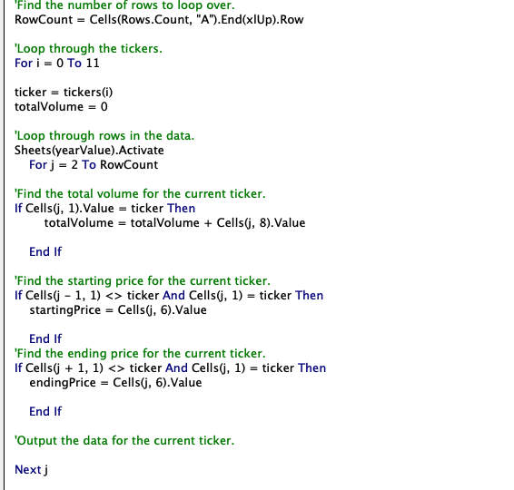
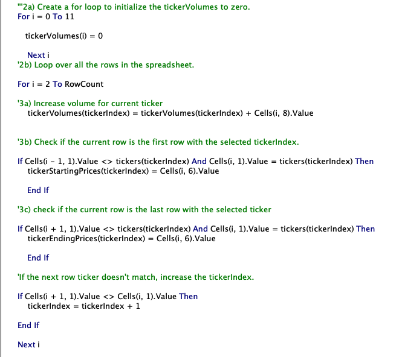

# Stock-analysis

# VBA Analysis

## Overview of Project

### Purpose
The objective of this project is to help Steve run an analysis using VBA to see which stocks are doing well in the years of 2017 and 2018. This would allow Steve to reuse the automated code with any stock, and reduce the chances of error and msimatch.

## Results
From the analysis, it is evident that the stock performance from 2017 is much better than the performance of 2018. This can be seen in these images  and  . In addition, execution times of the original VBA Script and the Refactored VBA Script are different. From the screenshots, it is clear that the elapsed run times for the reactored script for 2017 and 2018 are shorter than the elasped time for the original script. Screenshots: Original script:  and . Refactored script:  and . This shows that the refactored script runs faster than the original script. This can be attributed to nested for loop in the original script. Screen shots for the codes: Original script:  and Refactored script:.

## Summary

### Possible Advantages and Disadvantages of Refactoring Code
One main advantage of refactoring is to produce a better quality and more efficient code. Also, it is helps to remove code smell. It makes the software easy to understand. It's eaiser to read and maintain. 

A disadvantage of refactoring a code is it can be time-consuming especially when one is short of time. The chances of mistakes are higher when refactoring codes. 

Referenced from: 
https://anarsolutions.com/code-refactoring-concept-analysis/
https://stackoverflow.com/questions/43983284/what-are-the-advantages-and-disadvantages-of-refactoring-code-smell-in-software/44040105#44040105

### How the Advantages and Disadvantages are applied to the Refactoring the Original VBA script
The Refactored VBA script runs faster and is more efficient than the original code. Refactoring the VBA script was very time consuming as with each run, one has to go through the script to see what are bugs or errors in the code. Since, it was long code the chances of making mistakes and introducing bugs were higher.

